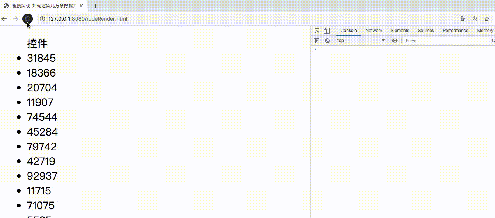
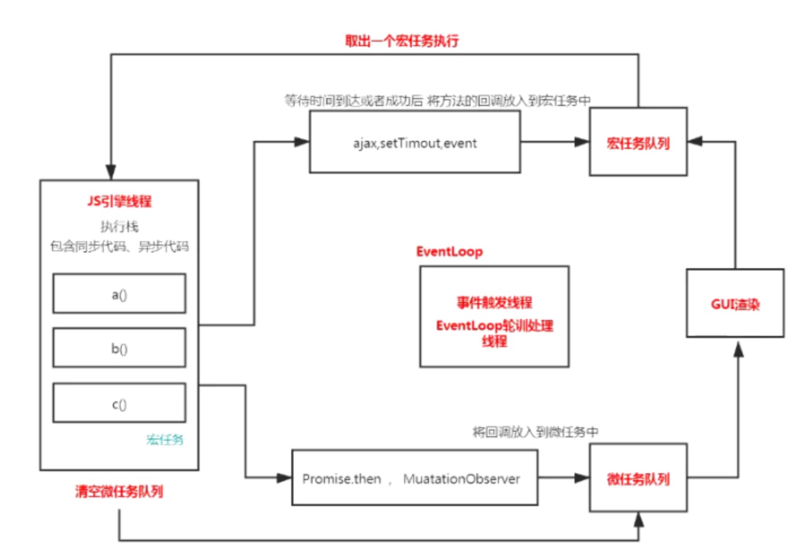
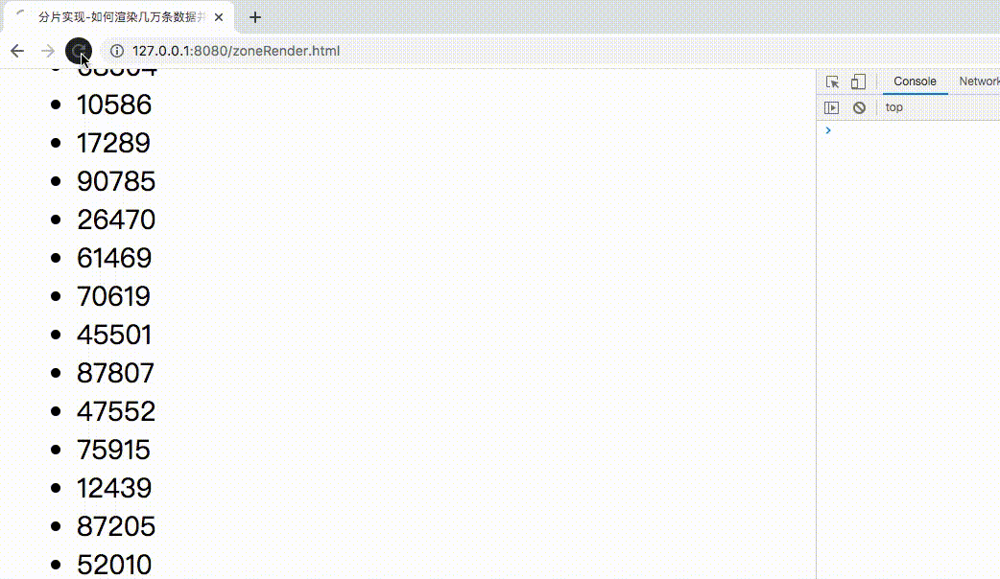
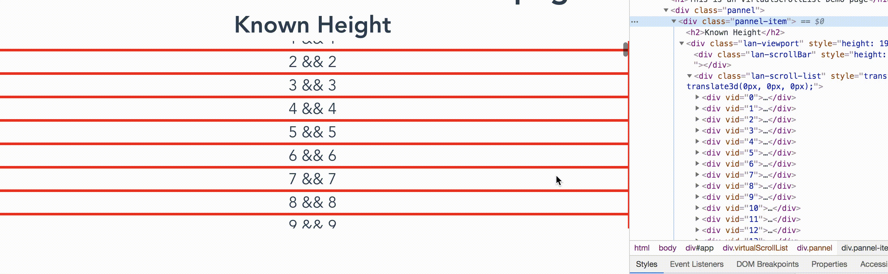

# 如何渲染几万条数据并不卡住界面

## 目录

- [背景](#背景)
- [粗暴实现](#粗暴实现)
- [分片实现](#分片实现)
- [虚拟滚动列表形式](#虚拟滚动列表形式)
  - [每项高度已知](#每项高度已知)
  - [每项高度未知](#每项高度未知)
- [总结](#总结)

## 背景

现在项目中列表页都会做成分页的形式，但是仍然存在一些场景：后端返回所有数据（可能成千上万条），前端渲染。下面提供几种解决思路。

## 粗暴实现
页面结构
```html
<ul>控件</ul>
```
逻辑功能
```js
// 插入十万条数据
const total = 100000
let ul = document.querySelector("ul")
console.time('loopTime')
function add() {
  // 优化性能，插入不会造成回流
  const fragment = document.createDocumentFragment()
  for (let i = 0; i < total; i++) {
    const li = document.createElement("li")
    li.innerText = Math.floor(Math.random() * total)
    fragment.appendChild(li)
  }
  ul.appendChild(fragment)
}
add()
console.timeEnd('loopTime')
```
通过`console.timeEnd('loopTime')`获取代码执行时间。

在上图中我们发现log很快打印，且只有几百毫秒；但是左上角却一直在loading，并没有完成渲染。所以此写法并不能统计到页面的渲染时间。

此时我们需要回顾下浏览器端的事件环机制。

从上图中我们得知当`JS引擎线程`中含有宏or微任务时，会分别入各自队列，当执行栈代码执行完成后，会首先清空微任务队列，然后触发一次`GUI渲染`（记住这个时机），再取出一个宏任务执行；若微任务中含有微任务，会将其入队列，注意其中包含的微任务会在这次一起清空，如果含有宏任务，加入宏任务队列；以此反复循环。

> 如果还不是很了解，可前往[面试必问之事件循环详解](https://github.com/careteenL/blog/issues/2)。

从上面我们可得知，在清空微任务队列后，会触发一次`GUI渲染`，所以此时我们可以在代码中加一个`setTimeout`即可。
```js
// 插入十万条数据
const total = 100000
let ul = document.querySelector("ul")
console.time('loopTime')
console.time('loopAndRenderTime') // ++
function add() {
  // 优化性能，插入不会造成回流
  const fragment = document.createDocumentFragment()
  for (let i = 0; i < total; i++) {
    const li = document.createElement("li")
    li.innerText = Math.floor(Math.random() * total)
    fragment.appendChild(li)
  }
  ul.appendChild(fragment)
}
add()
console.timeEnd('loopTime')
setTimeout(_ => { // ++
  console.timeEnd('loopAndRenderTime') // ++
}) // ++
```
此时能获取到js循环执行的时间加➕页面渲染的时间为大约`5s`。但当数据量很大时，页面白屏时间会特别长，用户早关闭了网站，所以此时需要优化。

> 代码存放在[VirtualScroll/rudeRender](https://github.com/careteenL/lan-vue/blob/master/examples/VirtualScroll/rudeRender.html)

## 分片实现

实现思路为：每几十毫秒渲染20个。这个间隔时间可以使用`requestAnimationFrame`。
```js
setTimeout(() => {
  // 插入十万条数据
  const total = 100000
  // 一次插入 20 条，如果觉得性能不好就减少
  const once = 20
  // 渲染数据总共需要几次
  const loopCount = total / once
  let countOfRender = 0
  let ul = document.querySelector("ul");
  function add() {
    // 优化性能，插入不会造成回流
    const fragment = document.createDocumentFragment();
    for (let i = 0; i < once; i++) {
      const li = document.createElement("li");
      li.innerText = Math.floor(Math.random() * total);
      fragment.appendChild(li);
    }
    ul.appendChild(fragment);
    countOfRender += 1;
    loop();
  }
  function loop() {
    if (countOfRender < loopCount) { // 递归终止条件
      window.requestAnimationFrame(add);
    }
  }
  loop();
}, 0);
```

可看出页面几乎没有白屏，在向下滚动页面时能看到滚动条会向上滚，这是因为递归过程在生成新的节点。

这种解决方法虽然在视觉上解决了白屏的问题，但是仍然存在`页面节点数庞大`的问题，当节点过于庞大时页面也会卡顿，所以还需要继续优化。

> 代码存放在[VirtualScroll/zoneRender](https://github.com/careteenL/lan-vue/blob/master/examples/VirtualScroll/zoneRender.html)

## 虚拟滚动列表形式

长列表的渲染主要存在两个问题
- 白屏时间过长
- 页面节点过多

`分片实现`解决了第一个问题，但页面节点仍然是全量的。因为浏览器视窗就这么高，我们能在用户滚动时动态替换当前视窗的内容，所以页面能始终保持少量节点，进而实现一个虚拟的滚动列表。

> 下面以Vue为例实现，代码存放在[@lan-vue/views/VirtualScrollList](https://github.com/careteenL/lan-vue/blob/master/src/views/VirtualScrollList.vue)和[@lan-vue/functions/VirtualScrollList](https://github.com/careteenL/lan-vue/blob/master/src/functions/VirtualScrollList.vue)

基于上述思路，我们希望提供一个组件，传入列表所有数据`items`，并且希望在浏览器视窗展示`remain`个项目，并且把每一项的高度`size`告诉组件，当滚动时在组件内去动态替换。
```html
<VirtualScrollList
  :size="24"
  :remain="8"
  :items="items"
>
  <div slot-scope="scope" class="item">
    {{ scope.item.value }}
  </div>
</VirtualScrollList>
```
组件内部的结构则如下
```html
<div
  class="lan-viewport"
  ref="viewport"
  @scroll="handleViewportScroll"
>
  <div
    class="lan-scrollBar"
    ref="scrollBar"
  ></div>
  <div class="lan-scroll-list">
    <div
      v-for="(item) in visibleData"
      :key="item.id"
      :vid="item.index"
      ref="items"
    >
      <slot :item="item"></slot>
    </div>
  </div>
</div>
```
- 需要一个包裹层`.lan-viewport`，表示在此区域内滑动。
- 一个表示整个列表高度的`.lan-scrollBar`，为了撑开滚动条高度。
- 真正展示列表的区域`lan-scroll-list`，渲染每一项。
他们的样式如下
```stylus
.lan-viewport {
  overflow-y: scroll;
  position: relative;
}
.lan-scroll-list {
  position: absolute;
  top: 0;
  left: 0;
  width: 100%;
}
```
`.lan-scroll-list`绝对定位的目的是让列表项始终在顶部区域。

然后页面加载完以后，我们需要为`.lan-viewport`和`.lan-scrollBar`赋值
```js
mounted() {
  this.$refs.viewport.style.height = this.remain * this.size + 'px' // 设置viewPrort的高度
  this.$refs.scrollBar.style.height = this.items.length * this.size + 'px' // 设置滚动条高度
  this.end = this.start + this.remain // 计算显示范围
}
```
还需要两个变量`start/end`记录当前视窗展示列表的范围。
为了在视觉上表现的更正常流畅，我们需要用三屏的数据去渲染，不然在滚动时会存在页面有白边的问题。

```js
computed: {
    prevCount() {
      return Math.min(this.start, this.remain)
    },
    nextCount() {
      return Math.min(this.items.length - this.end, this.remain)
    }
}
```
其中需要考虑列表的边界。

进而得到渲染的数据`visibleData`。
```js
computed: {
  formatData() {
    return this.items.map((item, index) => ({ ...item, index }))
  },
  visibleData() {
    let start = this.start - this.prevCount
    let end = this.end + this.nextCount
    return this.formatData.slice(start, end)
  }
}
```
然后在页面滚动时，需要始终展示三屏的中间屏。所以使用`transform`矫正由于三屏所导致的偏移量。
```html
<div
  class="lan-scroll-list"
  :style="{transform:`translate3d(0, ${offset}px, 0)`}"
>...</div>
```

### 每项高度已知

```js
methods: {
  handleViewportScroll() {
    let scrollTop = this.$refs.viewport.scrollTop
    this.start = Math.floor(scrollTop / this.size) // 计算开始
    this.end = this.start + this.remain // 计算结束
    this.offset = scrollTop - (scrollTop % this.size) - this.prevCount * this.size // 计算偏移量
  }
}
```


这个时候我们能看到效果，页面始终只有`3*remain`在这是`3*8=24`个项目，滚动时动态替换。

**那么问题又来了，当每个项目高度是不定的，此时传`size`并不管用，会发现滚动混乱。**

### 每项高度未知

高度虽然不定，但是我们能通过`getBoundingClientRect`方法在页面渲染后去获取节点的真实高度。

问题就变得简单了，需要预先使用一个变量存储所有列表的高度`height`、节点顶部距离顶部的位置`top`、节点底部距离顶部的位置`bottom`
```js
mounted() {
  // ...
  if (this.variable) { // 表示高度不定
    this.initPosition()
  }
},
methods: {
  initPosition() { // 初始化位置
    this.positions = this.items.map((item, index) => ({
      index,
      height: this.size,
      top: index * this.size,
      bottom: (index + 1) * this.size
    }))
  }
}
```
当滚动时根据滚动条高度计算出当前正处于哪一个项目
```js
handleViewportScroll() {
  let scrollTop = this.$refs.viewport.scrollTop
  if (this.variable) {
    this.start = this.getStartIndex(scrollTop) // 算出开始的位置
    this.end = this.start + this.remain
    this.offset = this.positions[this.start - this.prevCount] ? this.positions[this.start - this.prevCount].top : 0
  }
}
```
由于`positions`的`top/bottom`是根据索引算的且是有序递增的，所以算出开始的位置可以根据二分查找算法。

> 对二分算法不了解的，前往[详解二分查找]()查看

```js
getStartIndex(value) {
  let start = 0
  let end = this.positions.length
  let temp = null
  while (start < end) {
    let middleIndex = parseInt((start + end) / 2)
    let middleValue = this.positions[middleIndex].bottom
    if (value == middleValue) {
      return middleIndex + 1
    } else if (middleValue < value) {
      start = middleIndex + 1
    } else if (middleValue > value) {
      if (temp == null || temp > middleIndex) {
        temp = middleIndex
      }
      end = middleIndex - 1
    }
  }
  return temp
}
```
其中需要注意的一点是我们滚动的距离`scrollTop`值大概率和列表中的`top/bottom`不相等，所以我们期望去找到一个区间且最接近的值。其中使用`temp`变量存储这个最接近的值。

```js
handleViewportScroll() {
  let scrollTop = this.$refs.viewport.scrollTop
  if (this.variable) {
    this.start = this.getStartIndex(scrollTop) // 算出开始的位置
    this.end = this.start + this.remain
    this.offset = this.positions[this.start - this.prevCount] ? this.positions[this.start - this.prevCount].top : 0
  }
}
```
找到开始的位置，进而可知结束位置以及矫正偏移量。

上面的工作还不够，虽然找到开始结束位置，但是每一项的高度还是未知，我们需要在页面滚动加载完成后，去更新每一项的高度等详细信息。
```js
updated() {
  this.$nextTick(() => { // 获取真实元素的位置 更新top和bottom
    if (this.positions.length === 0) return
    let nodes = this.$refs.items
    if (!(nodes && nodes.length > 0)) {
      return
    }
    nodes.forEach(node => {
      let rect = node.getBoundingClientRect()
      let height = rect.height
      let index = +node.getAttribute('vid')
      let oldHeight = this.positions[index].height
      let val = oldHeight - height
      if (val) {
        // 先更新自己
        this.positions[index].bottom = this.positions[index].bottom - val
        this.positions[index].height = height
        for (let i = index + 1; i < this.positions.length; i++) { // 再更新后续兄弟
          this.positions[i].top = this.positions[i - 1].bottom
          this.positions[i].bottom = this.positions[i].bottom - val
        }
      }
    })
    this.$refs.scrollBar.style.height = this.positions[this.positions.length - 1].bottom + 'px'
    // this.offset = this.positions[this.start - this.prevCount]? this.positions[this.start - this.prevCount].top : 0
  })
}
```
主要就是遍历当前展示的项目，获取其真实高度，然后更新到`positions`，接着更新后续兄弟。最后滚动条的高度则是最后一条项目的`bottom`值。

下面使用`Mockjs`创建不同长度的句子去模拟高度不定。


> 虚拟滚动列表实现主要是参考于[@tangbc/vue-virtual-scroll-list](https://github.com/tangbc/vue-virtual-scroll-list)

## 总结

虚拟滚动列表实现非常巧妙的保证了**几乎没有白屏时间、少量的页面节点**。也让页面更加流畅且能支撑成千上万的列表。

但是仍然存在一些不足点
- 以上实现不支持每条项目有复选框等操作
- 需适配不同高度屏幕的项目展示个数

有感兴趣且有解决思路的大佬欢迎交流~

> 原创于[@careteen/Blog](https://github.com/careteenL/blog/blob/master/articles/vue-virtual-scroll-list.md)，转载请注明来源。

