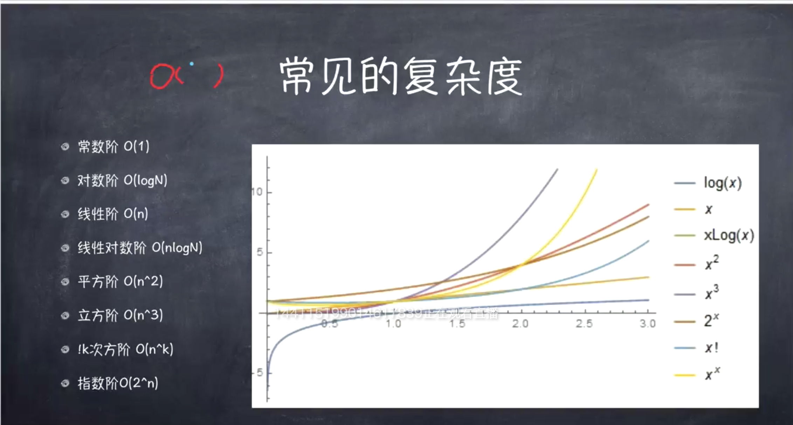

## 认识数据结构

### 开始

#### 认识数据结构

数据结构起源于程序设计

广义的说法：数据结构 = 数据存储 + 算法

狭义的说法：数据结构 = 数据存储

---

数据结构决定了数据存储的空间和时间效率问题，数据的写入和读取速度也决定了应该选择怎样的数据结构

根据对场景需求的不同，需要设计不同的数据结构：

- 一次写入，多次写出。（新浪微博发微博）（先持久化到数据库，反复读取的时候，磁盘性能很低，需要放到内存的缓存当中）
- 写得多，读的少。（服务器写日志）
- 读写都多。（人力管理系统，打卡签到，自己和领导都能看到）

---

#### 前端常见的数据结构

- 简单数据结构
  - 有序数据结构：线性表<顺序表（数组）、链表>，基于线性表<栈、队列>。有序数据结构省空间（存储空间小）
    - 对应几何中：一元一次方程
    - `引用`是对`指针`的封装
    - 栈和队列 基于线性表，加上一些特定的规则即算法约定操作。操作受限的线性表，本质上没啥区别。
  - 无序数据结构：集合、字典、散列表。无序数据结构省时间（读取时间快）
    - 对应几何中：双曲线
    - 集合：
    - 字典：
    - 散列表（hash）：

- 复杂数据结构
  - 树、堆、图
    - 树：
    - 堆：**用在内存管理中，用处很广泛，思想很重要**

---

#### 浅析数据结构物

数据元素相互之间的关系称为结构。数据项比数据元素更小。

一个班级中每个同学是一个数据元素，数据项就是每个同学的姓名、身高...

- 逻辑结构：反映数据元素之间的逻辑关系

- 存储结构：数据结构物在计算机中的表示

- 算法： 对数据的操作

- [思维导图](../assets/数据结构.xmind)

- 问题：

  - 数据结构什么时候在内存中消失？
    - C/C++需要用代码手动销毁
    - 现代编程语言带有GC，引用计数，当变量没有被引用时销毁。

--- 

#### 认识算法

- 巧妇难为无米之炊，算法（巧妇）的基础是数据结构（米）。

- 算法是完成某个特定任务的过程。 **程序 = 数据结构 + 算法** （争当一个设计师、架构师）

- 算法不是数学，但是可以用数学来描述

- 我们要做一件事情，这个过程本身就是算法

- 我们最常用的增删改查是算法的一部分（`sort`也是v8封装好的排序算法）

- 数据库的索引一般用B树

- 算法可以用自然语言、流程图、伪代码和计算机语言等手段来表示

- 在面向对象语言中，算法通常通过类的方法实现

- 调别人API（无他，唯手熟尔）。。。理解其中思想才是硬道理

--- 

#### 算法的五大特征

- 有穷性：算法必须能在执行有限个步骤之后终止

- 确切性：每一步骤必须有确切的定义（容错性得好，考虑兼容性）

- 输入项：有0个或多个输入（有限），用来规定初始情况，所谓0个输入是指算法本身定义了初始条件

- 输出项：有一个或多个输出，是对输入数据处理后的结果。没有输出的算法毫无意义

- 可行性：算法中执行的任何计算步骤都是可以被分解为基本的可执行的操作步，每个计算步骤都可以在有限时间内完成（也成为有效性）
  - 暴力破解密码

---

#### 怎样衡量算法的好坏

- 算法的好坏主要通过算法复杂度来衡量
  - 时间复杂度
  - 空间复杂度

- 正确性

- 可读性

- 健壮性

---

#### 常见的复杂度

---

#### 计算算法复杂度

- 随着问题规模n的不断增大，时间复杂度不断增大，算法的执行效率越低

- 技巧
  - 有几重循环，一般来说一重就是O(n)
  - 如果有二分，则为O(logN)
  - 保留最高项，去除常数项

---

#### 例子

---

#### 必须掌握的基本算法

- 枚举

  - 核心思想： 枚举所有的可能
  - 本质： 就是从所有和选答案中去搜索正确的解，使用该算法需要满足两个条件
    - 可预先确定候选答案的数量（猜生日，有限种可能，总可以猜到；利用一些策略优化：先猜月份再猜日期）
    - 候选答案的范围在求解之前必须有一个确定的集合（生日是具体的一天，但是密码位数不确定）
  - 特点
    - 没去算法简单粗暴，枚举所有可能，尽可能尝试所有的方法
    - 速度可能很慢，确实我们最应该优先考虑的
    - 实现最简单，并且得到的结果总是正确的

- 递归

  - 核心思想：通过重复将问题**分解**为同类的子问题而解决问题的方法
  - 特点：
    - 函数可以通过调用自身来进行递归
    - 递归可以完全取代循环
  - 递归由下面两部分组成
    - 递归主体，就是要循环解决问题的代码
    - 递归的跳出条件，递归不能一直递归下去，需要完成一定条件后跳出（函数栈超出2^16次方会自动退出）

- 基本排序

- 基本查找

---

#### 怎样养成算法思维

- 养成算法思维是一个长期的过程，要时刻问自己几个问题：
  - 结果是什么？
  - 步骤是什么？
  - 判断结果的标准是什么？

- 化繁为简
  - 很难在第一时间内得到正确的思路的，这时候可以尝试一种由简至繁的思路。首先把问题规模缩小到非常容易解答的地步。用来解决动态规划问题
  - 例子：登月 - 工具 -> 宇航员 , 火箭 -> 宇航舱 

- 分而治之
  - 把问题分为两半，变成两个与原来问题同构的问题
  - 当场会这种思路时，其实只需考虑两个问题：
    - 一分为二以后，问题是否被简化了？
    - 根据一分为二的两个问题的解，能否方便得出整个问题的解？

- 化虚为实
  - 使用另外一种形式进行替换
  - 例子：用浮点数画一个矩形，先把浮点数换成整数

---

#### 怎么解决面试问题

- 面试的时候，在遇到算法题目的时候，应该揣摩面试官的意图，挺好关键词，比如：有序的数列做查找、要求算法复杂度是O(logN)这类一般就是用二分的思想

- 算法题目的阶梯思路分以下四步：
  - 先降低数量级
  - 根据阶梯步骤编写程序，优先将
  - 检查程序正确性
  - 是否可以优化（由浅入深），有能力的话可以故意预留优化点，这样可以体现个人的技术能力

- 例子：通信协议（SLIP）传输数据。
  - **补上**
