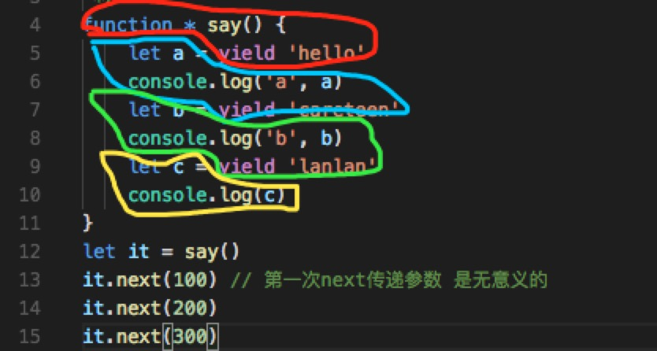

## 异步发展流程-手摸手带你实现一个promise

篇幅较长，但重点为以下几点，可直接前往感兴趣的话题，各取所需。

  - [回调函数](#回调函数)
    - 解析[lodash的after函数](#lodash-after函数)
    - 解析[Node读取文件](#Node读取文件)
  - [为什么要用promise](#为什么要用promise)
  - [手摸手带你撸一个promise](#手摸手带你撸一个promise)
    - 循序渐进讲解从零到一实现一个promise
    - 面试常考点，也请带着问题阅读。
      - promise的三个状态之间的关系？
      - 如何实现promise的链式调用？
      - 如何判断并解决promise循环引用的问题？
      - 如何实现promise的finally方法？
      - 如何实现promise的all方法？
  - [generator用法](#generator用法)
  - [async-await](#async-await)

所有涉及的例子均有完整代码存放在[仓库](https://github.com/careteenL/66ball)，感兴趣的同学可直接clone在本地运行。

**本文主要简单探讨下异步的前世今生，并手摸手带你实现一个promise**

由于JavaScript单线程的特性，我们需要异步编程解决阻塞问题。

### 异步编程问题

我们每天的工作中都可能会用到以下函数做一些异步操作

- setTimeout
- onClick
- ajax

### 如何解决异步问题

解决异步问题现有的方式如下

- 回调函数
- promise
- generator 恶心
- aync+await

下面将逐一介绍各种方式如何解决异步问题

### 回调函数

首先介绍一下高阶函数，即一个函数的参数是函数或者函数返回值为函数，此函数称做高阶函数。

#### lodash-after函数

再来看一个例子，常使用lodash的同学应该熟悉的一个方法[_.after(n, fn)](https://www.css88.com/doc/lodash/#_aftern-func)，作用是fn函数在调用n次以后才会执行。
```js
let fn = after(3, () => {
  console.log('该执行了')
})
fn()
fn()
fn() // => 该执行了
```

那如何实现一个`after`函数呢，其实主要是利用**闭包和计数**的思想：
```js
const after = (times = 1, cb = _defaultCb) => {
  return function () {
    if (--times === 0) {
      cb()
    }
  }
}

const _defaultCb = () => {}
```

其中`cb`作为函数参数传入`after`函数，即是高阶函数的一个应用。

[after函数例子地址](https://github.com/careteenL/66ball/blob/master/src/20181124-promise/callback/1.after.js)

[⬆️回到顶部](#异步发展流程)

#### Node读取文件

现在有一个场景，读取两个文件内容，赋值给一个对象，并打印。

在[./static](https://github.com/careteenL/66ball/blob/master/src/20181124-promise/callback/static/name.txt)下新建了两个文件`name.txt`,`age.txt`，期望读取文件内容并赋值给一个对象，然后打印。
```js
const fs = require('fs')

let schoolInfo = {}

fs.readFile('./static/name.txt', 'utf8', (err,data) => {
  schoolInfo['name'] = data
})
fs.readFile('./static/age.txt', 'utf8', (err, data) => {
  schoolInfo['age'] = data
})
console.log(schoolInfo) // {}
```
由于读取文件的过程是异步的，所以通过这种方式是无法满足预期的。

并且异步操作存在以下三个问题

- 1、异步没法捕获错误
- 2、异步编程中，可能存在回调地狱
- 3、多个异步操作，在同一时间内，如何同步异步的结果？

回调地狱大家应该非常熟悉了。
```js
const fs = require('fs')

let schoolInfo = {}
fs.readFile('./static/name.txt', 'utf8', (err,data) => {
  schoolInfo['name'] = data
  fs.readFile('./static/age.txt', 'utf8', (err, data) => {
    schoolInfo['age'] = data
  })  
})
```
[本例地址](https://github.com/careteenL/66ball/blob/master/src/20181124-promise/callback/2.read.js)

并且两个文件读取时间是累加，不是并行的，如果文件很多并且很大，那等待时间将非常久，所以并不推荐。

这里针对第三个问题**多个异步操作，在同一时间内，如何同步异步的结果？**，可以采用**发布订阅**的方式解决
```js
// 一个简易的方法订阅对象
let dep = {
  arr: [],
  emit () {
    this.arr.forEach((fn) => {
      fn()
    })
  },
  on (fn) {
    this.arr.push(fn)
  }
}
```
不了解发布订阅模式的请移步我的[另一篇博客](https://github.com/careteenL/66ball/tree/master/src/20181126-pub_sub)

通过以下操作即可达到预期
```js
let schoolInfo = {}
const fs = require('fs')

// 一个简易的方法订阅对象
let dep = {
  arr: [],
  emit () {
    this.arr.forEach((fn) => {
      fn()
    })
  },
  on (fn) {
    this.arr.push(fn)
  }
}

// 订阅
dep.on(() => {
  // 只有读取了两个文件的内容并赋值以后才会打印
  if (Object.keys(schoolInfo).length === 2){
    console.log(schoolInfo)
  }
})

// 读取触发
fs.readFile('./static/name.txt', 'utf8', (err, data) => {
  schoolInfo['name'] = data
  dep.emit()
})
fs.readFile('./static/age.txt', 'utf8', (err, data) => {
  schoolInfo['age'] = data
  dep.emit()
})
```
在每次读取文件时触发打印事件，事件中进行判断只有两次读取都完成的情况下才会打印。

以上方法看似解决了上面提到的第三个问题**多个异步操作，在同一时间内，同步异步的结果**，但是随着需求的变动，需要再读取一个`address`文件，就需作如下变动：
```js
...
// 订阅
dep.on(() => {
  // 只有读取了两个文件的内容并赋值以后才会打印
  if (Object.keys(schoolInfo).length === 3){ // 2改为3
    console.log(schoolInfo)
  }
})
...
// 新增一项adress
fs.readFile('./static/adress.txt', 'utf8', (err, data) => {
  schoolInfo['adress'] = data 
  dep.emit()
})
```
再新增多项的话，代码的扩展性就非常差了。

下面将将介绍如何实现一个promise然后解决上面提到的问题

[node读取文件代码地址](https://github.com/careteenL/66ball/blob/master/src/20181124-promise/callback/2.read.resolve.js)

[⬆️回到顶部](#异步发展流程)

### 为什么要用promise

那么接下来介绍promise的出现所解决的问题

- 回调地狱，如果多个异步请求，有连带关系，回调嵌套
- 多个异步实现并发的话，会出现无法同步异步的返回结果
- 错误处理不方便

### promise用法

- 不跟你多BB

### 手摸手带你撸一个promise

首先需要提到[promise/A+规范](https://promisesaplus.com/)，我们自己编写的promise是需要一个标准的。可以根据此标准一步一步来。

#### 需要三个状态

```js
const PENDING = 'pending' // 等待态
const FULFILLED = 'fulfilled' // 成功态
const REJECTED = 'rejected' // 失败态
```
- 当状态为`pending`时
  - 可能转换为`fulfilled`或`rejected`
- 当状态为`fulfilled`或`rejected`时
  - 不能转为其他状态
  - 必须有一个`value`或`reason`且不能改变

> 面试点：promise的三个状态之间的关系？

[⬆️回到顶部](#异步发展流程)

#### then方法

更详细请移步文档，这里说几个重点

- 处理`executor`函数中代码异常的情况
- 处理`executor`函数中代码为异步的情况
- 处理then的多次调用
- 处理then的链式调用

**处理`executor`函数中代码异常的情况**

对`executor`try-catch即可
```js
class Promise {
  constructor(executor) {
    let self = this
    self.status = PENDING
    self.value = undefined
    self.reason = undefined    

    const resolve = (value) => {
      if(self.status === PENDING){
        self.value = value
        self.status = FULFILLED
      }      
    }

    const reject = (reason) => {
      if(self.status === PENDING){
        self.reason = reason
        self.status = REJECTED
      }      
    }

    try{
      executor(resolve, reject) // 如果执行这个executor执行时候抛出异常 应该走下一个then的失败
    }catch(e){
      reject(e)// 出错了 reason就是错误
    }    
  }

  then (onFulfilled, onRejected) {
    if (this.status === FULFILLED){
      onFulfilled(this.value)
    }
    if (this.status === REJECTED){
      onRejected(this.reason)
    }    
  }
}
```
如下使用
```js
let Promise = require('./3.1.promise.js')

let p = new Promise((resolve,reject) => {
  resolve('xx')
})

p.then((data) => {
  console.log('p success',data)
}, (err) => {
  console.log(err)
})
// => p success xx
```
[简易版1.0.0地址](https://github.com/careteenL/66ball/blob/master/src/20181124-promise/promise/3.1.%08promise.js)以及[测试用例地址](https://github.com/careteenL/66ball/blob/master/src/20181124-promise/promise/3.1.promise.case.js)

虽然实现了一个很简易的promise，但还存在很多问题，比如下面
```js
let Promise = require('./3.1.promise.js')
let p2 = new Promise((resolve,reject) => {
  setTimeout(() => {
    resolve('xxx')
  }, 1000)
})

p2.then((data) => {
  console.log('p2 success',data)
}, (err) => {
  console.log(err)
})
// => p success xx
//    p second success xx
```
对于异步的代码是不会处理的

[⬆️回到顶部](#异步发展流程)

**处理`executor`函数中代码为异步的情况**

使用发布订阅模式的思想处理
```js
class Promise {
  constructor(executor) {
    let self = this
    self.status = PENDING
    self.value = undefined
    self.reason = undefined
    self.onResolvedCallbacks = [] // 新增 一个数组存放成功处理
    self.onRejectedCallbacks = [] // 新增 一个数组存放失败处理

    const resolve = (value) => {
      if(self.status === PENDING){
        self.value = value
        self.status = FULFILLED
        self.onResolvedCallbacks.forEach((fn) => { // 新增 触发时遍历所有
          fn()
        })     
      }      
    }

    const reject = (reason) => {
      if(self.status === PENDING){
        self.reason = reason
        self.status = REJECTED
        self.onRejectedCallbacks.forEach((fn) => { // 新增 触发时遍历所有
          fn()
        })        
      }      
    }

    try{
      executor(resolve, reject) // 如果执行这个executor执行时候抛出异常 应该走下一个then的失败
    }catch(e){
      reject(e)// 出错了 reason就是错误
    }    
  }

  then (onFulfilled, onRejected) {
    if (this.status === FULFILLED){
      onFulfilled(this.value)
    }
    if (this.status === REJECTED){
      onRejected(this.reason)
    }    
    if( this.status === PENDING){ // 新增 处理异步
      // 默认当前 new Promise  executor中是有异步的
      this.onResolvedCallbacks.push(() => {
        onFulfilled(this.value)
      });
      this.onRejectedCallbacks.push(() => {
        onRejected(this.reason)
      })
    }    
  }
}

```
使用
```js
let Promise = require('./3.2.promise.js')

let p = new Promise((resolve,reject) => {
  setTimeout(() => {
    resolve('xxx')
  }, 1000)
})

p.then((data) => {
  console.log('p success',data)
}, (err) => {
  console.log(err)
})

p.then((data) => {
  console.log('p second success',data)
}, (err) => {
  console.log(err)
})
// 一秒以后打印
// => p success xxx
//    p second success xxx
```

[简易版1.0.1地址](https://github.com/careteenL/66ball/blob/master/src/20181124-promise/promise/3.2.%08promise.js)以及[测试用例地址](https://github.com/careteenL/66ball/blob/master/src/20181124-promise/promise/3.2.promise.case.js)

[⬆️回到顶部](#异步发展流程)

**处理then的链式调用**

和`jQuery`的链式调用一个套路，不过在这儿需要返回一个新的`promise`而不是当前，因为成功态和失败态是不能转为其他状态的
```js
class Promise {
  constructor(executor) {
    let self = this
    self.status = PENDING
    self.value = undefined
    self.reason = undefined
    self.onResolvedCallbacks = []
    self.onRejectedCallbacks = []  

    const resolve = (value) => {
      if(self.status === PENDING){
        self.value = value
        self.status = FULFILLED
        self.onResolvedCallbacks.forEach((fn) => {
          fn()
        })     
      }      
    }

    const reject = (reason) => {
      if(self.status === PENDING){
        self.reason = reason
        self.status = REJECTED
        self.onRejectedCallbacks.forEach((fn) => {
          fn()
        })        
      }      
    }

    try{
      executor(resolve, reject) // 如果执行这个executor执行时候抛出异常 应该走下一个then的失败
    }catch(e){
      reject(e)// 出错了 reason就是错误
    }    
  }

  then (onFulfilled, onRejected) {
    let self = this
    let promise2 // 这个promise2 就是我们每次调用then后返回的新的promise
    // 实现链式调用主要的靠的就是这个promise
    promise2 = new Promise((resolve, reject) => {
      if (self.status === FULFILLED) {
        // 此方法内使用`setTimeout`是为了`_resolvePromise`中能使用到`promise2即自身`
        setTimeout(() => {
          try {
            // 这个返回值是成功函数的执行结果
            let x = onFulfilled(self.value)
            // 判断promise2 和 x 也是then函数返回的结果和promise2的关系 如果x 是普通值 那就让promise2成功 如果 是一个失败的promise那就让promise2 失败
            self._resolvePromise(promise2, x, resolve, reject)
          } catch (e) {
            reject(e)
          }
        }, 0)
      }

      if (self.status === REJECTED) {
        setTimeout(() => {
          try {
            // 这个返回值是失败函数的执行结果
            let x = onRejected(self.reason)
            // 判断promise2 和 x 也是then函数返回的结果和promise2的关系 如果x 是普通值 那就让promise2成功 如果 是一个失败的promise那就让promise2 失败
            self._resolvePromise(promise2, x, resolve, reject)
          } catch (e) {
            reject(e)
          }
        }, 0)
      }   
      
      if (self.status === PENDING) {
        // 默认当前 new Promise  executor中是有异步的
        self.onResolvedCallbacks.push(() => {
          setTimeout(() => {
            try {
              let x = onFulfilled(self.value)
              self._resolvePromise(promise2, x, resolve, reject)
            } catch (e) {
              reject(e)
            }
          }, 0)          
        });
        self.onRejectedCallbacks.push(() => {
          setTimeout(() => {
            try {
              let x = onRejected(self.reason)
              self._resolvePromise(promise2, x, resolve, reject)
            } catch (e) {
              reject(e)
            }
          }, 0)          
        })
      }       
    })
    return promise2
  }

  // 内部核心方法 处理 成功或者失败执行的返回值 和promise2的关系
  _resolvePromise (promise2, x, resolve, reject) {
    // 这个处理函数 需要处理的逻辑韩式很复杂的
    // 有可能这个x 是一个promise  但是这个promise并不是我自己的
    resolve(x) // 目前只做一个简单处理
  }
}
```
使用
```js
let Promise = require('./3.3.promise.js')

let p = new Promise((resolve,reject) => {
  setTimeout(() => {
    resolve('xxx')
  }, 1000)
})

// promise 中 每次调用then 都应该返回一个新的promise 
// promise的实例只能成功或者失败  不能既成功又失败
p.then((data) => {
  console.log('p success', data)
}, (err) => {
  console.log(err)
}).then((data) => {
  console.log('success then', data)
}, (err) => {
  console.log(err)
})
// 一秒以后打印
// => p success xxx
//    success then undefined
```

[简易版1.0.2地址](https://github.com/careteenL/66ball/blob/master/src/20181124-promise/promise/3.3.%08promise.js)以及[测试用例地址](https://github.com/careteenL/66ball/blob/master/src/20181124-promise/promise/3.3.promise.case.js)

> 面试点：如何实现promise的链式调用？

如代码中只是简单处理`_resolvePromise`方法

[⬆️回到顶部](#异步发展流程)

**完善_resolvePromise**

再移步规范文档[处理_resolvePromise](https://promisesaplus.com/#the-promise-resolution-procedure)

需要考虑以下几种情况

`_resolvePromise (promise2, x, resolve, reject)`

- x为一个普通值
- x为promise2时会导致循环调用
- x为一个对象或者函数
  - x为一个promise

考虑以上进行完善
```js
  // 内部核心方法 处理 成功或者失败执行的返回值 和promise2的关系
  _resolvePromise (promise2, x, resolve, reject) {
    // 这个处理函数 需要处理的逻辑韩式很复杂的
    // 有可能这个x 是一个promise  但是这个promise并不是我自己的
    if (promise2 === x) {
      return reject(new TypeError('Chaining cycle detected for promise '))
    }
    // 不单单需要考虑自己 还要考虑 有可能是别人的promise
    let called // 文档要求 一旦成功了 不能调用失败
    if ((x !== null && typeof x === 'object') || typeof x === 'function') {
      // 这样只能说 x 可能是一个promise
      try {
        // x = {then:function(){}}
        let then = x.then // 取then方法
        if (typeof then === 'function') {
          then.call(x, y => { // resolve(new Promise)
            if (called) return
            called = true
            resolvePromise(promise2, y, resolve, reject) //  递归检查promise
          }, reason => {
            if (called) return
            called = true
            reject(reason)
          })
        } else { // then方法不存在
          resolve(x); // 普通值
        }
      } catch (e) { // 如果取then方法出错了，就走失败
        if (called) return
        called = true
        reject(e)
      }
    } else { // 普通值
      resolve(x)
    }
  }
```
使用
```js
let Promise = require('./3.4.promise.js')

// 普通返回值
let p = new Promise((resolve,reject) => {
  setTimeout(() => {
    resolve('xxx')
  }, 1000)
})
p.then((data) => {
  console.log(`p success ${data}`)
  return 'first result'
}, (err) => {
  console.log(err)
}).then((data) => {
  console.log(`p success then ${data}`)
}, (err) => {
  console.log(`p error ${err}`)
})
// 一秒以后打印
// => p success xxx
//    p success then first result

// 抛错
let p2 = new Promise((resolve,reject) => {
  setTimeout(() => {
    resolve('p2 xxx')
  }, 1000)
})
p2.then((data) => {
  throw new Error('just happy')
}, (err) => {
  console.log(err)
}).then((data) => {
  console.log(`p2 success then ${data}`)
}, (err) => {
  console.log(`p2 error ${err}`)
})
// 一秒以后打印
// => p2 error Error: just happy

// promise
let p3 = new Promise((resolve,reject) => {
  setTimeout(() => {
    resolve('p3 xxx')
  }, 1000)
})
p3.then((data) => {
  return new Promise((resolve, reject) => {
    resolve('p3 data')
  }).then(data => {
    return data
  })
}, (err) => {
  console.log(err)
}).then((data) => {
  console.log(`p3 success then ${data}`)
}, (err) => {
  console.log(`p3 error ${err}`)
})

// 循环引用 - 例子待改
let p4 = new Promise((resolve,reject) => {
  let circleP = new Promise((resolve, reject) => {
    resolve(circleP)
  })  
  return circleP
})
p4.then((data) => {
  console.log(data)
})
```

[简易版1.0.3地址](https://github.com/careteenL/66ball/blob/master/src/20181124-promise/promise/3.4.%08promise.js)以及[测试用例地址](https://github.com/careteenL/66ball/blob/master/src/20181124-promise/promise/3.4.promise.case.js)

> 面试点：如何判断并解决promise循环引用的问题？

[⬆️回到顶部](#异步发展流程)

以上一个符合`Promise/A+`规范的promise基本完成

那怎么验证自己写的promise是否正确呢？

追加以下`deferred`方法以供检查
```js
// 基于Promise实现Deferred 也提供给`promises-aplus-tests`做检查
static deferred () {
  let dfd = {}
  dfd.promise = new Promise((resolve, reject) => {
    dfd.resolve = resolve
    dfd.reject = reject
  })
  return dfd    
}
```

安装检查工具`promises-aplus-tests`
```shell
npm i -g promises-aplus-tests
```

执行检查
```shell
promises-aplus-tests your-promise.js
```
都是绿色表示检查通过

[代码地址](https://github.com/careteenL/66ball/blob/master/src/20181124-promise/promise/3.5.%08promise.js)

[⬆️回到顶部](#异步发展流程)

### promise周边

以上只是一个简易的promise，我们期望完善更多功能：

- catch方法
- 静态方法
- finally方法
- all方法
- race方法

下面实现的地址在[简易版1.1.1](https://github.com/careteenL/66ball/blob/master/src/20181124-promise/promise/3.6.%08promise.js)以及[测试用例](https://github.com/careteenL/66ball/blob/master/src/20181124-promise/promise/3.6.promise.case.js)

#### catch方法

实现
```js
// 用于promise方法链时 捕获前面onFulfilled/onRejected抛出的异常
catch (onRejected) {
  return this.then(null, onRejected)
}
```
使用
```js
let Promise = require('./3.6.promise.js')

// catch
let p = new Promise((resolve,reject) => {
  setTimeout(() => {
    resolve('xxx')
  }, 1000)
})
p.then((data) => {
  console.log(`p success then ${data}`)
}).then((data) => {
  throw new Error('just happy')
}).catch(err => {
  console.log(`p ${err}`)
})
// => p success then xxx
//    p Error: just happy
```

[⬆️回到顶部](#异步发展流程)

#### 静态方法

实现
```js
static resolve (value) {
  return new Promise(resolve => {
    resolve(value)
  })
}

static reject (reason) {
  return new Promise((resolve, reject) => {
    reject(reason)
  })
}
```
使用
```js
let Promise = require('./3.6.promise.js')

// static resolve reject
let p2 = Promise.resolve(100)
p2.then(data => {
  console.log(`p2 ${data}`)
})
let p3 = Promise.reject(999)
p3.then(data => {
  console.log(`p3 ${data}`)
}).catch(err => {
  console.log(`p3 err ${err}`)
})
// => p2 100
//    p3 err 999
```

[⬆️回到顶部](#异步发展流程)

#### finally方法

实现
```js
// finally 也是then的一个简写
finally (cb) {
  // 无论成功还是失败 都要执行cb 并且把成功或者失败的值向下传递
  return this.then(data => {
    cb()
    return data
  }, err => {
    cb()
    throw err
  })
}
```
使用
```js
let Promise = require('./3.6.promise.js')

// finally
let p4 = Promise.resolve(100)
p4.then(data => {
  throw new Error('error p4')
}).finally(data => {
  console.log(`p4 ahhh`)
}).catch(err => {
  console.log(`p4 err ${err}`)
})
// => p4 ahhh
//    p4 err Error: error p4
```

> 面试点：如何实现promise的finally方法？

[⬆️回到顶部](#异步发展流程)

#### all方法

实现
```js
/**
 * @desc 当这个数组里的所有promise对象全部变为resolve状态的时候，才会resolve。
 * @param {Array<Promise>} promises promise对象组成的数组作为参数
 * @return 返回一个Promise实例
 */
static all (promises) {
  return new Promise((resolve, reject) => {
    let arr = []
    // 处理数据的方法
    let i = 0
    const processData = (index, data) => {
      arr[index] = data //数组的索引和长度的关系
      if (++i === promises.length){ // 当数组的长度 和promise的个数相等时 说明所有的promise都执行完成了
        resolve(arr)
      }
    }
    for (let i = 0; i < promises.length; i++){
      let promise = promises[i]
      if (typeof promise.then == 'function'){
        promise.then(function (data) {
          processData(i, data) // 把索引和数据 对应起来 方便使用
        }, reject)
      }else{
          processData(i,promise)
      }
    }
  })    
}
```
使用
```js
let Promise = require('./3.6.promise.js')

// all & race
const fs = require('fs')
const path = require('path')
const resolvePath = (file) => {
  return path.resolve(__dirname, '../callback/static/', file)
}
const read = (file) => {
  return new Promise((resolve, reject) => {
    fs.readFile(resolvePath(file), 'utf8', (err, data) => {
      if(err) reject(err)
      resolve(data)
    })    
  })
}
// all
Promise.all([
  read('name.txt'),
  read('age.txt')
]).then(data => {
  console.log(`all ${data}`)
}).catch(err => {
  console.log(`all err ${err}`)
})
// => all Careteen,23
```

> 面试点：如何实现promise的all方法？

[⬆️回到顶部](#异步发展流程)

#### race方法

实现
```js
/**
 * @desc 只要有一个promise对象进入 FulFilled 或者 Rejected 状态的话，就会继续进行后面的处理(取决于哪一个更快)
 * @param {Array<Promise>} promises 接收 promise对象组成的数组作为参数
 * @return 返回一个Promise实例
 */
static race (promises) {
  return new Promise((resolve, reject) => {
    promises.forEach((promise, index) => {
      promise.then(resolve, reject)
    })
  })    
}
```
使用
```js
let Promise = require('./3.6.promise.js')

// all & race
const fs = require('fs')
const path = require('path')
const resolvePath = (file) => {
  return path.resolve(__dirname, '../callback/static/', file)
}
const read = (file) => {
  return new Promise((resolve, reject) => {
    fs.readFile(resolvePath(file), 'utf8', (err, data) => {
      if(err) reject(err)
      resolve(data)
    })    
  })
}
// race
Promise.race([
  read('name.txt'),
  read('age.txt')  
]).then(data => {
  console.log(`race ${data}`)
}).catch(err => {
  console.log(`race err ${err}`)
})
// => race Careteen/23 不一定 得看读取速度
```

[⬆️回到顶部](#异步发展流程)

### generator用法

在理解generator之前先看一个例子。

**实现一个可传任意个参数的加法函数**

老司机们三下五除二就能得出求和函数
```js
const sum = () => {
  return [...arguments].reduce((ret, item) => {
    return ret + item
  }, 0)
}
sum(1, 2, 3, 4) // => 10
sum(1, 2, 3, 4, 5) // => 15
```

[以上代码地址](https://github.com/careteenL/66ball/blob/master/src/20181124-promise/generator/1.generator.js)

使用ES6的展开运算符`...`可枚举出所有参数，再用数组包裹，即可将一个类数组转换为一个数组。利用reduce实现累加，方可得出求和函数。

那展开运算符能否操作对象佯装的类数组呢？那就来试一试
```js
let obj = {
  0: 1,
  1: 2,
  2: 3,
  length: 3
}
console.log([...obj]) // => TypeError: obj[Symbol.iterator] is not a function
```

[以上代码地址](https://github.com/careteenL/66ball/blob/master/src/20181124-promise/generator/2.generator.js)

可得知对象是不能被迭代的，根据报错信息，我们再改进代码
```js
let o = { 0: 1, 1: 2, 2: 3, length: 3, [Symbol.iterator]: function () {
  let currentIndex = 0
  let that = this
  return {
    next(){
      return {
        value: that[currentIndex++],
        done: currentIndex-1 === that.length
      }
    }
  }
}}
let arr = [...o] // [1, 2, 3]
```

再使用generator实现
```js
let o = {0: 1, 1: 2, 2: 3, length: 3, [Symbol.iterator]: function* () {
    let index = 0
    while (index !== this.length) {
      yield this[index]
      index++
    }
  }
}
let arr = [...o] // [1, 2, 3]
```

[以上代码地址](https://github.com/careteenL/66ball/blob/master/src/20181124-promise/generator/3.generator.js)

生成器可以实现生成迭代器，生成器函数就是在函数关键字中加个*再配合yield来使用，并且yield是有暂停功能的。
```js
function * say() {
  yield 'node'
  yield 'react'
  yield 'vue'
}
```
那如何遍历迭代器呢？
```js
let it = say ()
let flag = false
do{
  let {value, done} = it.next()
  console.log(value)
  flag = done
}while(!flag)
// => node
//    react
//    vue
//    undefined
```

[以上代码地址](https://github.com/careteenL/66ball/blob/master/src/20181124-promise/generator/4.generator.js)

迭代器提供`next`方法，可得出迭代的`value`和是否已经迭代完成`done`，用一个循环即可遍历。

yield的返回值的使用场景
```js
function * say() {
    let a = yield 'hello'
    console.log('a', a)
    let b = yield 'careteen'
    console.log('b', b)
    let c = yield 'lanlan'
    console.log(c)
}
let it = say()
it.next(100) // 第一次next传递参数 是无意义的
it.next(200)
it.next(300)
// => a 200
//    b 300
```

[以上代码地址](https://github.com/careteenL/66ball/blob/master/src/20181124-promise/generator/5.generator.js)

**generator执行流程大体如下图**



可看出第一次next传递参数是无意义的，所以输出结果为 `a 200 b 300`

以上均为同步的情况，接下来看下yield后面是异步的场景。

再通过一个例子来深入理解。

通过读取文件`1.txt`的内容为`2.txt`，再读取`2.txt`的内容为`3.txt`，最后读取`3.txt`中的内容`Careteen`

首先需要准备三个文件，放置在`./static`目录下，再准备读取文件的函数，
```js
const fs = require('fs')
const path = require('path')

const resolvePath = (file) => {
  return path.resolve(__dirname, './static/', file)
}

function read (file) {
  return new Promise((resolve, reject) => {
    fs.readFile(resolvePath(file), 'utf8', (err, data) => {
      if (err) reject(err)
      resolve(data)
    })
  })
}
```
在使用generator实现读取函数
```js
function * r() {
   let r1 = yield read('1.txt')
   let r2 = yield read(r1)
   let r3 = yield read(r2)
  return r3
}
```
期望的过程是通过读取文件`1.txt`的内容为`2.txt`，再读取`2.txt`的内容为`3.txt`，最后读取`3.txt`中的内容`Careteen`，进行返回。

首先我们能想到使用回调的方式解决，因为yield后面是一个promise
```js
let it = r()
let {value,done} = it.next()
value.then((data) => { // data->2.txt
  let {value,done} = it.next(data)
  value.then((data) => {
    let { value, done } = it.next(data)
    value.then((data) => {
      console.log(data) // data-> 结果
    })
  })
})
// => Careteen
```
但这又会产生回调地狱，所以需要优化，我们需要一个迭代函数，通过递归可以实现
```js
function co (it) {
  return new Promise((resolve, reject) => {
    // next方法  express koa  原理 都是这样的
    function next (data) { // 使用迭代函数来实现 异步操作按顺序执行
      let { value, done } = it.next(data)
      if(done){
        resolve(value)
      }else{
        value.then((data) => {
          next(data)
        },reject)
      }
    }
    next()
  })
}
```
使得异步可以按顺序来执行，最后看一下执行
```js
co(r()).then((data) => {
  console.log(data)
})
// => Careteen
```

[以上代码地址](https://github.com/careteenL/66ball/blob/master/src/20181124-promise/generator/3.generator.js)

非常完美的实现了，但是如果yield的后面是一个同步操作，没有then方法，在`co`方法中我们还需要特殊处理，也比较简单。

牛逼的[TJ大神的CO](https://github.com/tj/co)库就对此做了很完善的处理，感兴趣的可前往仓库看看源码，只有200多行。

**generator的应用：**

- [redux-saga使用 yield* 对 Sagas 进行排序](https://redux-saga-in-chinese.js.org/docs/advanced/SequencingSagas.html)
- koa1

**如何实现generator**
```js
function * careteen() {
  yield 100
  yield 200
}
```
可查看[babel编译后的结果](https://babeljs.io/repl#?babili=false&browsers=&build=&builtIns=false&spec=false&loose=false&code_lz=GYVwdgxgLglg9mABAKkRAhgJwKZW9sACgEpEBvAKAEgBPGbAGwBNEBGABnYsUVvucQAmThQC-QA&debug=false&forceAllTransforms=false&shippedProposals=false&circleciRepo=&evaluate=false&fileSize=false&timeTravel=false&sourceType=module&lineWrap=true&presets=es2015%2Creact%2Cstage-2&prettier=false&targets=&version=6.26.0&envVersion=)

[⬆️回到顶部](#异步发展流程)

### async-await

- 写起来是同步的，语法糖很甜不腻。

- bluebird
  - promisify
  - promisifyAll

- async-await
  - 串行情况
  - 并行情况

- async-await内部机制
  - 在babel中的编译结果，实质上就是generator+co

- 例子
  - 三个小球滚动
    - 回调实现 回调地狱
    - promise实现 也不是很美观
    - generator实现 需要co库
    - async-await实现 
```js
async function careteen() {
  await 100
  await 200
  return 300
}
careteen.then(_ => {
  console.log(_)
})
```
通过[babel编译后](https://babeljs.io/repl#?babili=false&browsers=&build=&builtIns=false&spec=false&loose=false&code_lz=IYZwngdgxgBAZgV2gFwJYHsIysATgU2X3ywAoBKGAbwCgBIYAd2FWRgEYAGTmmGB5qxgAmbr34FkCXFgDMYgL40ck4hAB0yABYlSAfRgBeAHzV6UTCHQAbfOuvoA5vvI0F5IA&debug=false&forceAllTransforms=false&shippedProposals=false&circleciRepo=&evaluate=false&fileSize=false&timeTravel=false&sourceType=module&lineWrap=true&presets=es2015%2Creact%2Cstage-2&prettier=false&targets=&version=6.26.0&envVersion=)可看出实质上是通过`generator+co`的方式实现的。


[⬆️回到顶部](#异步发展流程)


