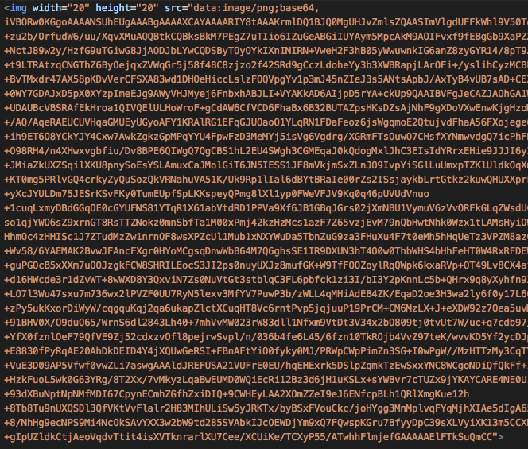

## 编码那些事

### 目录

- 二进制位、字节基础概念
- JavaScript中的进制
- [进制间的转换](#进制间的转换)
  - 对任意进制的数进行任意进制转换
  - 将任意进制数转换为十进制数
  - [几道关于parseInt的面试题](#几道关于parseInt的面试题)
- [编码发展历史](#编码发展历史)
- [base64编码](#base64编码)
  - [为什么需要base64](#为什么需要base64)

- [如何实现base64](#如何实现base64)
  - [读取buffer转为json对象](#读取buffer转为json对象)
  - [将10进制转为2进制](#将10进制转为2进制)
  - [将2进制拼一起3\*8然后分隔成4\*6](#将2进制拼一起3\*8然后分隔成4\*6)
  - [然后将2进制转成10进制](#然后将2进制转成10进制)
  - [base64码](#base64码)
  - [取到每一个base64码](#取到每一个base64码)

- [小结](#小结)

### 进制间的转换
#### 对任意进制的数进行任意进制转换
[Number.prototype.toString(radix)](https://developer.mozilla.org/zh-CN/docs/Web/JavaScript/Reference/Global_Objects/Number/toString)

#### 将任意进制数转换为十进制数
[parseInt(string, radix)](https://developer.mozilla.org/zh-CN/docs/Web/JavaScript/Reference/Global_Objects/parseInt)

#### 几道关于parseInt的面试题

说到parseInt，不得不提到一个很有意思的面试题
```js
// 会输出什么？
[1, 2, 3].map(parseInt)
// => 1, NaN, NaN
```
`map`方法第一个参数为函数，函数有三个参数，`array.map((item, index, array) => { ... })`

实际上相当于
```js
function fn (item, index) {
  return parseInt(item, index)
}
[1, 2, 3].map(fn)
// parseInt迭代过程相当于如下
// parseInt(1, 0) => 1
// parseInt(2, 1) => NaN
// parseInt(3, 2) => NaN
```

再来看一个类似的面试题
```js
// 会输出什么？
'1 2 3'.replace(/\d/g, parseInt)
// => 1, NaN, 3
```
`replace`方法第二个参数若是一个函数，函数会有若干个参数。第一个为匹配模式的字符串；第二个为与模式中子表达式匹配的字符串，可以有零个或多个这样的参数。

实际上相当于如下
```js
function fn (...args) {
  // 只会取前两个参数
  return parseInt(args[0], args[1])
}
'1 2 3'.replace(/\d/g, fn)
// parseInt迭代过程相当于如下
// parseInt('1', 0) => 1
// parseInt('2', 2) => NaN
// parseInt('3', 4) => 3
```

其实在`mdn`中对`parseInt/map/replace`已经讲解的很详细，期望大家在工作之余不要太过浮躁，别做伸手党，静下心来啃一下文档并多做实践，很多面试题自然会迎刃而解。

### 编码发展历史

#### ASCII

#### GBK2312

#### GBK

#### GB18030/DBCS

#### Unicode

#### UTF-8

现在的标准，有如下特点

- UTF-8 就是在互联网上使用最广的一种 Unicode 的实现方式
- UTF-8就是每次以8个位为单位传输数据
- 而UTF-16就是每次 16 个位
- UTF-8 最大的一个特点，就是它是一种变长的编码方式
- Unicode 一个中文字符占 2 个字节，而 UTF-8 一个中文字符占 3 个字节
- UTF-8 是 Unicode 的实现方式之一

### base64编码

#### 为什么需要base64

在开发时，经常会有一些小图标图片，每一个图片都会有一次HTTP请求，由于**浏览器对同一个域名的并发数量有限制**，所以我们应该尽可能减少HTTP请求个数。

本文主要讲解编码相关，那就只讲解从编码入手如何去减少HTTP请求。

在计算机内部，任何信息最终都是使用一系列二进制存储，图片也不例外。

而且在`img`标签的`src`属性后跟上一个`base64`字符，如果该字符有效，那么会正常显示图片。

### 如何实现base64

以下涉及的所有代码均在[仓库](./encoding/2.case.js)中，感兴趣的可以自取。

#### 读取buffer转为json对象

首先准备一个`2.txt`文件。
```
冯兰兰啊我说今晚月色这么美，你说是的。
```
case.js代码
```js
const fs = require('mz/fs')
const path = require('path')

// 读取成buffer对象
async function read2JSON () {
   let ret = await fs.readFile(path.resolve(__dirname, '2.txt'))
   console.log(ret.toJSON())
   return ret.toJSON()
}
read2JSON()
// => { type: 'Buffer', data: [ 229, 134, 175, 229... ] }
```

上面的依赖[mz/fs](https://github.com/normalize/mz)已经将`fs`都包装成`promise`，所以我们能写的更像同步。

`readFile`函数如果第二个参数没有指定会读取成一个`buffer`流，是由一个个`16进制`数组合在一起的。

[buffer.toJSON](http://www.runoob.com/nodejs/nodejs-buffer.html)可以将一个buffer流转为一个json对象，十六进制也会被转十进制。如上输出所示。

#### 将10进制转为2进制

十进制转为二进制可以通过`Number.toString(2)`方法

```js
// 将10进制转为2进制
async function data2b () {
  let data = await read2JSON()
  let ret = []
  data.data.forEach(item => {
    ret.push(item.toString(2))
  })
  console.log(ret)
  return ret
}
data2b()
// => [ '11100101', '10000110', '10101111', '11100101'...]
```

#### 将2进制拼一起3\*8然后分隔成4\*6

一个汉字在`UTF-8`规范中由三个字节组成，一个字节由`8`个二进制物理位构成。所以一个汉字实际占用内存`3*8`，`base64`中我们实际需要`6`个物理位表示一个字节即`2**6`，所以做重新分割`4*6`。

```js
async function split () {
  let data = await data2b()
  let dataStr = data.join('')
  let ret = []

  let splitUnit = 6
  let flag = 0
  while (flag < dataStr.length) {
    ret.push(dataStr.substr(flag, splitUnit))
    flag = flag + splitUnit
  }
  console.log(ret)
  return ret
}
split()
// => [ '111001', '011000', '011010', '101111'...]
```

#### 然后将2进制转成10进制

二进制转为十进制可以通过`parseInt(string, 2)`方法

```js
async function data20 () {
  let data = await split()
  let ret = data.map(item => {
    return parseInt(item, 2)
  })
  console.log(ret)
  return ret
}
data20()
// => [ 57, 24, 26, 47, 57, 24, 22, 48, 57, 24, 22, 48 ]
```

#### base64码

`base64`中的`64`实际上是根据`2**6`所来，表示则由`大写字母、小写字母、数字、+/`构成。

```js
const lowerCases = 'abcdefghijklmnopqrstuvwxyz'
const numbers = '0123456789'
const base64lib = `${lowerCases.toUpperCase()}${lowerCases}${numbers}+/`
console.log(base64lib)
// => ABCDEFGHIJKLMNOPQRSTUVWXYZabcdefghijklmnopqrstuvwxyz0123456789+/
```

#### 取到每一个base64码

然后我们则可以取到每一个`base64`码

```js
async function main () {
  let data = await data20()
  let ret = []
  data.forEach(item => {
    ret.push(base64lib[item])
  })
  console.log(ret.join(''))
  return ret.join()
}

main()
// => 5Yav5YWw5YWw5ZWK5oiR6K+05LuK5pma5pyI6Imy6L+Z5LmI576O77yM5L2g6K+05piv55qE44CC
```

我们可以前往[base64在线转码解码](http://base64.us/)进行验证。


#### 简化代码

对以上思路进行代码简化
```js
const CHARTS = 'ABCDEFGHIJKLMNOPQRSTUVWXYZabcdefghijklmnopqrstuvwxyz0123456789+/'
function transfer (str) {
  let buf = Buffer.from(str)
  let result = ''
  for(let b of buf){
    result += b.toString(2)
  }
  return result.match(/(\d{6})/g).map(val => parseInt(val, 2)).map(val => CHARTS[val]).join('')
}
let fl = transfer('冯')
console.log(fl) // => 5Yav
```

### 小结

如上我们可以实现将中文转为base64，同理我们也可以转换图片。
```js
async function read2JSON () {
  // let ret = await fs.readFile(path.resolve(__dirname, '2.txt'))
  // 读取图片
  let ret = await fs.readFile(path.resolve(__dirname, '../assets/encoding-base64-example.png'))
  console.log(ret.toJSON())
  return ret.toJSON()
}
```

**特别的：** 由于[将2进制拼一起3\*8然后分隔成4\*6](#将2进制拼一起3\*8然后分隔成4\*6)，原来存储一个汉字需要三个字节，现在需要四个字节存储，所以转换为`base64`后会比之前大`3/1`。


下面笑脸图片则是由`img的src属性展示的`（github似乎将base64过滤了，并没有展示），不过本文并没有实现图片转base64，因为其逻辑较为复杂，但是本文讲解了大致思路，感兴趣的可再做深究。

<img width="20" height="20" src="data:image/png;base64,iVBORw0KGgoAAAANSUhEUgAAABgAAAAXCAYAAAARIY8tAAAKrmlDQ1BJQ0MgUHJvZmlsZQAASImVlgdUFFkWhl9V50TqpgkSmpxzakBybEByFoWmm9CEpm1oVMzI4AiOARURjOgQFRyVIKOIiGJgEDCAig7IoKCugwFRUdkClmZn9+zu2b/OrfudW6/uu/XqvXMuAOQBtkCQBksBkM7PEgZ7uTIio6IZuGeABGiIUYAym5MpcAkM9AOIFvxf9fEBgGb9XaPZXP/+/L9KmpuQyQEACkQ4npvJSUf4PGKtHIEwCwAUYkBjdZZglksQpgmRAhE+NctJ89w2y/HzfG9uTGiwG8JjAODJbLYwCQDSByTOyOYkIXnINIRN+VweH2F3hB05yWwuwnkIG6anZ8zyGYR14/8pT9JfcsaLc7LZSWKe/5Y54d15mYI09tr/czn+t9LTRAtzqCNGThZ6ByOejqxZVWqGr5j58f4BC8zjzo2f42SRd9gCczLdoheYy3b3XWBRapjLArOFi+/yslihCyzMCBbn56f5+4nzJ7DEnJDpEbLAiTxP1gLnJIdGLHA2L9x/gTNTQ3wXx7iJ40JRsLjmRKGn+BvTMxdr47AX58pKDvVerCFSXA83wd1DHOeHiccLslzFOQVpgYv1p3mJ45nZIeJ3s5ANtsApbJ/AxTyB4vUB7sAD+CEXA/HmwAKYAWuAVJWVsGZ2TwO3DMFaIS8pOYvhgpyaBAaLzzE2ZJibmjEBmD2D87/4/cDc2YLo+MUYH1kXZh+yF+0WY7GDAJxD5pX0XYzpImeEJg9AWyVHJMyej6FnbxhABJLI+VYAKkAD6AIjpD5rYA+ckUp9QAAIBVFgJeCAZJAOhGA1WA+2gHxQCHaD/aAUHAUnQBU4Dc6CJnARXAHXwW3QA+6Dx2AIjIJXYAJ8BNMQBOEgCkSFFCBVSAsygMwhJuQIeUB+UDAUBcVBSRAfEkHroa1QIVQElULHoWroF+gCdAW6CfVCD6FhaBx6B32BUTAZpsHKsDZsAjNhF9gXDoVXwEnwKjgHzoN3wiVwOXwKboSvwLfh+/AQ/AqeRAEUCUVHqaGMUEyUGyoAFY1KRAlRG1EFqGJUOaoO1YLqRN1FDaFeoz6jsWgqmoE2QtujvdFhaA56FXojege6FF2FbkR3oO+ih9ET6O8YCkYJY4Cxw7AwkZgkzGpMPqYYU4FpwFzD3MeMYj5isVg6Vgdrg/XGRmFTsOuwO7CHsfXYNmwvdgQ7icPhFHAGOAdcAI6Ny8Ll4w7iTuEu4/pwo7hPeBJeFW+O98RH4/n4XHwxvgbfiu/Dv8BPE6QIWgQ7QgCBS1hL2EU4SWgh3CGMEqaJ0kQdogMxlJhC3EIsIdYRrxEHie9JJJI6yZYUROKRNpNKSGdIN0jDpM9kGbI+2Y0cQxaRd5IryW3kh+T3FApFm+JMiaZkUXZSqilXKU8pnySoEsYSLAmuxCaJMolGiT6JN5IESS1JF8mVkjmSxZLnJO9IvpYiSGlLuUmxpTZKlUldkOqXmpSmSptJB0inS++QrpG+KT0mg5PRlvGQ4crkyZyQuSozQkVRNahuVA51K/Uk9Rp1lIal6dBYtBRaIe00rZs2ISsjaykbLrtGtkz2kuwQHUXXprPoafRd9LP0B/QvcspyLnIJctvl6uT65Kbkl8g7yyfIF8jXy9+X/6LAUPBQSFXYo9Ck8EQRraivGKS4WvGI4jXF10toS+yXcJYULDm75JESrKSvFKy0TumEUpfSpLKKspeyQPmg8lXl1yp0FWeVFJV9Kq0q46pUVUdVnuo+1cuqLxmyDBdGGqOE0cGYUFNS81YTqR1X61abVtdRD1PPVa9Xf6JB1GBqJGrs02jXmNBU1VymuV6zVvORFkGLqZWsdUCrU2tKW0c7QnubdpP2mI68DksnR6dWZ1CXouuku0q3XPeeHlaPqZeqd1ivRx/Wt9JP1i/Tv2MAG1gb8AwOG/QaYgxtDfmG5Yb9RmQjF6Nso1qjYWO6sZ9xrnGT8RsTTZNokz0mnSbfTa1M00xPmj42kzHzMcs1azF7Z65vzjEvM79nQbHwtNhk0Wzx1tLAMsHyiOWAFdVqmdU2q3arb9Y21kLrOutxG02bOJtDNv1MGjOQuYN5wxZj62q7yfai7Wc7a7ssu7N2f9ob2afa19iPLdVZmrD05NIRB3UHtsNxhyFHhmOc4zHHISc1J7ZTudMzZw1nrnOF8wsXPZcUl1Mub1xNXYWuDa5TbnZuG9za3FHuXu4F7t0eMh5hHqUeTz3VPZM8az0nvKy81nm1eWO8fb33ePezlFkcVjVrwsfGZ4NPhy/ZN8S31PeZn76f0K9lGbzMZ9neZYP+Wv58/6YAEMAK2BvwJFAncFXgr0HYoMCgsqDnwWbB64M7Q6ghsSE1IR9DXUN3hT4O0w0ThbWHS4bHhFeHT0W4RxRFDEWaRG6IvB2lGMWLao7GRYdHV0RPLvdYvn/5aIxVTH7MgxU6K9asuLlScWXaykuxkrHs2HNxmLiIuJq4r+wAdjl7Mp4Vfyh+guPGOcB5xXXm7uOOJzgkFCW8SHRILEocS3JI2ps0nuyUXJz8mufGK+W9TfFOOZoylRqQWpk6kxaRVp+OT49Lv8CX4afyOzJUMtZk9AoMBPmCoVV2q/avmhD6CisyocwVmc1ZNKTZ6RLpin4QDWc7Zpdlf1odvvrcGuk1/DVda/XXbl/7Iscz5+d16HWcde3r1dZvWT+8wWXD8Y3QxviN7Zs0NuVtGt3stblqC3FL6pbfck1zi3I/bI3Y2pKnnLc5b+QHrx9q8yXyhfn92+y3Hf0R/SPvx+7tFtsPbv9ewC24VWhaWFz4dQdnx62fzH4q+WlmZ+LO7l3Wu47sxu7m736wx2lPVZF0UU7RyN5lexv3MfYV7PuwP3b/zWLL4qMHiAdEB4ZK/EqaD2oe3H3wa2ly6f0y17L6Q0qHth+aOsw93HfE+UjdUeWjhUe/HOMdGzjudbyxXLu8+AT2RPaJ5yfDT3b+zPy5ukKxorDiWyW/cqgquKqj2qa6ukapZlctXCuqHT8Vc6rntPvp5jqjuuP19PrCM+CM6MzLX+J+eXDW92z7Oea5uvNa5w81UBsKGqHGtY0TTclNQ81Rzb0XfC60t9i3NPxq/GvlRbWLZZdkL+1qJbbmtc5czrk82SZoe30l6cpIe2z746uRV+91BHV0X/O9duO65/WrnS6dl2843Lh40+7mhVvMW023rW83dll1Nfxm9VtDt3V34x2bO809tj0tvUt7W/uc+q7cdb97/R7r3u37/vd7H4Q9GOiP6R8a4A6MPUx7+PZR9qPpx5sHMYMFT6SeFD9Velr+u97v9UPWQ5eG3Ye7noU8ezzCGXn1R+YfX0fznlOeF79QfVE9Zj52cdxzvOfl8pejrwSvpl/n/036b4fe6L45/6fzn10TkROjb4VvZ97teK/wvvKD5Yf2ycDJpx/TP05PFXxS+FT1mfm580vElxfTq7/ivpZ80/vW8t33++BM+syMgC1kz7UCKMTgxEQA3lUCQIkCgNoDAFFivkeeEzTf188R+E8830fPyRqAE20AhDkDEID4Y4jXQUwGeRSI+FBnAFtYiO0fyky0MJ/PRWpCWpPimZn3SG+I0wPgW//MzHTTzMy3CqTYR0gf83G+N5+VFNLbTKS4+VuE3D09AP5Vfwf0vwZLi7aswgAAAldJREFUSA21VUFrE0EU/hqEHExrk5DSlpZqmkTzEwSxxYNC8WCgoNDiQfQkFf+IeBR6U1roQcihKqhQ2lKwID3HmDUWEtJqSFLbTSCHJO73ZMrsZltS6n4w7Mzse9/39s2bt32tVqsDD+HzkFuoL5wk0G63YRg/8T2Xx/7vMkyzLqaBwEUMD0WQiEcRi12Bz3d6jH1uKSLx+sYWBvr7cTUZx9jYKAYCARE4NE0UiyVkMzkcHh1heuqGCJ0UaJfAxuYXGLkfuH3nFsYt4tNQsIQ+fVxDLD6JqZvXXU1tAiTfK+0jlZqB3+93dXBuNptNpNMfMDI67CpynECmhZGfhZxiDIQ+9CWHEyLAA2XOmZZeI9eJ6ENfcpBLh1QRlXmgKue12h+8Tb8Tu9nUXQSDl3QfVKtVvFlalr2H83MIhULiSw5yJRKTx/byBSxFVouCkc/joHYgg3MnMplvqFYqMjhXIAe5dIgA65ylqBCLRjEYHJTBuRPJ5DWEwmEZnCuQg1w6JEW8RKrO+ZIpefJoTrezzZmS588WbHtckENdSPVSvkAtzvu0H+8/NhHg9ecNPS9Mi4NcOkSAvYXX3w2bW9td285SVAbkIJcOEWDjYm9xQ7FQwspKGru7BfyyDpC39sXLVyiXK13m5CCXDhFgV2TjYm9x4sH9e5i4PI7trztYff8Z9XoDC08fIxIJ20zpSw5y2cBuypHNGp3FxdedRqMha7Xfy5M+9CWH016+gIpUZldkCtjAeoVqdvTtit4isXVTknrarlXU7Cee/XCUiKe/TCXyP55/ATwhhFlmjefGAAAAAElFTkSuQmCC">



