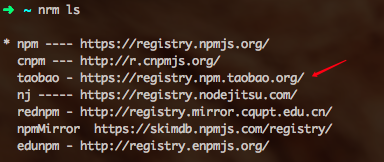
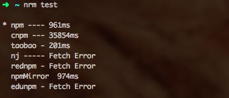
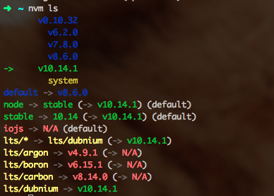
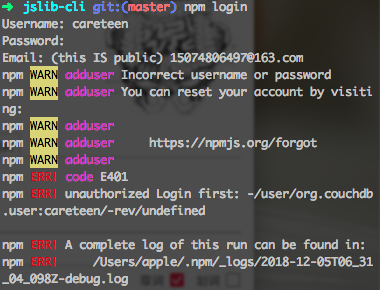
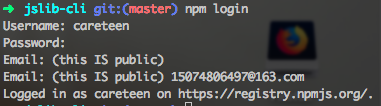
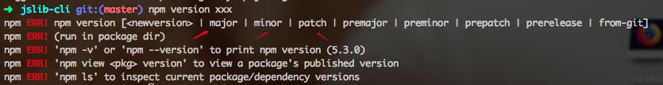

## 使用nrm和nvm管理你的npm源和node版本

### 目录

- [使用nrm管理你的npm-registry](#使用nrm管理你的npm-registry)
- [使用nvm管理你的node版本](#使用nvm管理你的node版本)
- [发布个人专属的npm包](#发布个人专属的npm包)

### 使用nrm管理你的npm-registry

`npm`源在国外，对于国内的开发人员来说，下载包的速度经常很慢，而且`npm`还经常挂。

可能在之前我们会通过如下做法将源指向淘宝源，然后使用`cnpm`操作，也可以使用的很愉快。

```shell
npm install -g cnpm --registry=https://registry.npm.taobao.org
```

我们也可以通过工具`nrm`去切换`npm源`，它提供如下多个源供我们选择，更推荐选择淘宝源。



下面来简单说下安装和常用命令

- 全局安装
  ```shell
  npm install -g nrm
  ```

- 测试下各个源的速度
  ```shell
  nrm test
  ```
  
  
  可看出`taobao`是最快的

- 查看当前正在使用的源
  ```shell
  nrm current
  ```

- 使用某个源
  ```shell
  # 切换到淘宝源
  nrm use taobao
  ```

- 然后在对应项目正常使用npm即可
  ```shell
  $yourRepo npm install
  ```

- 查看更多指令的使用帮助
  ```shell
  nrm help
  ```

比较有意思的说法是`nrm`要取代`npm`？？？可是`nrm`的安装在`mac`和`windows`下是依靠`npm`的。噗：）

### 使用nvm管理你的node版本

对`cnpm`源进行管理可以让我们平时安装包时更快。同样的我们平时也可能会有切换`node`版本的场景。这个时候可以使用`nvm`对其进行管理。



可能有时在使用一些基于Node低版本封装的框架时我需要`v0.10.32`，但大多数时候都会使用较新版Node，此时也希望做一下版本管理。

- 全局安装
```shell
npm install -g nvm
```

- 查看nvm版本
```shell
nvm -v
```

- 下载最新的 node 版本
```shell
nvm install latest
```

- 查看远程已经存在的版本
```shell
# 可能会很慢，请耐心等待
nvm ls-remote
```

- 下载指定版本nodejs
```shell
nvm install v8.6.0
# 默认是64位，32位需指定
nvm install v8.6.0 32
```

- 当前使用版本
```shell
nvm current
```

- 使用指定版本
```shell
nvm use v8.6.0
```

- 查看已经安装的nodejs版本
```shell
nvm list
# or
nvm ls
```

- 查看nodejs版本
```shell
node -v
```

### 发布个人专属的npm包

对于`jser`来说，每天都会和大量的`npm`包打交道，那怎么编写个人专属的包并发布到`npm`官网上呢？

可前往[一个JS第三方库的五脏六腑](./package-viscera.md)查看细节，提供了[JS第三方库脚手架](https://github.com/careteenL/jslib-cli)的项目，可以拿来即用。这里只做发布`npm`的讲解。

#### 发布

当你已经完成一个`npm包`的开发后，我们需要一个`npm账号`，可前往[npm官网](https://www.npmjs.com/)注册。

然后登陆账号
```shell
npm login
```

如果输入账号密码登录报以下错误



那说明你现在的`npm源`不是官网，如果使用上面说到的[使用nrm管理你的npm-registry](#使用nrm管理你的npm-registry)，我们需要先切换`npm源`
```shell
# 切换
nrm use npm
# 查看确保当前源为npm
nrm current
```

如下登录成功后



进行发布
```shell
npm publish
```

当然也可以撤销一个自己的`npm包`
```shell
# --force参数意为强制
npm unpulish --force
```

#### 更新

在`package.json`文件的`version`字段管理包的版本。


- `a`中的数字表示大版本号。一般在项目重构后更新时去递增。
- `b`中的数字表示小版本号。一般是新增API后更新时去递增。
- `c`中的数字表示小版本号中打补丁。一般是修复当前版本的bug后去递增。

递增管理版本号，我们不可能傻到每次更新都手动修改这个字段。

可以通过`npm version xxx`进行自动递增。



如上我们可以通过三个箭头指向的单词进行版本更新

```shell
# 更新大版本 v1.0.0 -> v2.0.0
npm version major
# 更新小版本 v2.0.0 -> v2.1.0
npm version minor
# 打补丁 v2.1.0 -> v2.1.1
npm version patch
```

然后再发布
```shell
npm publish
```

