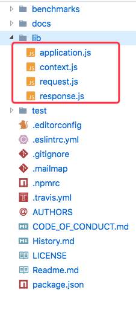

# 手摸手带你实现KOA

## 目录

- [koa的使用](#koa的使用)
- [简单阅读下koa源码](#简单阅读下koa源码)
- [ctx挂载了什么东西](#ctx挂载了什么东西)
- [next构建的洋葱模型](#next构建的洋葱模型)
  - [中间件含异步代码如何保证正确执行](#中间件含异步代码如何保证正确执行)
- [基于事件驱动去处理异常](#基于事件驱动去处理异常)

## koa的使用

koa的使用非常简单，引入依赖后编写
```js
const Koa = require('koa')
let app = new Koa()
app.use((ctx, next) => {
  console.log(ctx)
})
app.listen(4000)
```
然后在浏览器端打开`http://127.0.0.1:4000`即可访问

若没有指定返回`body`，koa默认处理成了`Not Found`

### ctx

再进一步扩展代码，看看ctx上面有哪些东西
```js
// ...
  console.log(ctx)
  console.log('native req ----') // node原生的req
  console.log(ctx.req.url)
  console.log(ctx.request.req.url)
  console.log('koa request ----') // koa封装了request
  console.log(ctx.url)
  console.log(ctx.request.url)
  // native req ----
  // /
  // /
  // koa request ----
  // /
  // /
// ...
```
以上[代码存放在仓库](./1.use.js)，自取。

在[koa官网](https://koajs.cn/#-request-)有说明在ctx挂载了一系列`request`和`response`的属性别名。

```js
// 封装后相当于
ctx = {}
ctx.request = {}
ctx.response = {}
ctx.req = ctx.request.req = req
ctx.res = ctx.response.res = res
// ctx.url 代理了 ctx.request.url
```

### next

以下[代码存放在仓库](./2.use.js)，自取。

使用next看看作用
```js
const Koa = require('koa')
let app = new Koa()
app.use((ctx, next) => {
  console.log(1)
  next()
  console.log(2)
})
app.use((ctx, next) => {
  console.log(3)
  next()
  console.log(4)
})
app.use((ctx, next) => {
  console.log(5)
  next()
  console.log(6)
})
app.listen(4000)
// 1
// 3
// 5
// 6
// 4
// 2
```
从上面代码打印结果可以看出，next的作用就是做一个占位符。可以看成以下形式
```js
app.use((ctx, next) => {
  console.log(1)
  app.use((ctx, next) => {
    console.log(3)
    app.use((ctx, next) => {
      console.log(5)
      next()
      console.log(6)
    })
    console.log(4)
  })
  console.log(2)
})
```
这即是洋葱模型。

如果某个中间件有异步代码呢？
```js
const Koa = require('koa')
let app = new Koa()
// 异步函数
const logger = () => {
  return new Promise((resolve, reject) => {
    setTimeout(_ => {
      console.log('logger')
      resolve()
    }, 1000)
  })
}
app.use((ctx, next) => {
  console.log(1)
  next()
  console.log(2)
})
app.use(async (ctx, next) => {
  console.log(3)
  await logger()
  next()
  console.log(4)
})
app.use((ctx, next) => {
  console.log(5)
  next()
  console.log(6)
})
app.listen(4000)
// 1
// 3
// 2
// 等待1s
// logger
// 5
// 6
// 4
```
此时打印结果并不是我们预期的结果，我们期望的是`1 -> 3 -> 1s logger -> 5-> 6-> 4 ->2`

此时我们需要在`next`前面加一个`await`
```js
// ...
app.use(async (ctx, next) => {
  console.log(1)
  await next()
  console.log(2)
})
// ...
```

## 简单阅读下koa源码

`koa`致力于成为一个更小、更富有表现力、更健壮的`web`开发框架。

其源码也是非常轻量且已读。



核心文件四个

- `application.js`：简单封装`http.createServer()`并整合`context.js`
- `context.js`：代理并整合`request.js`和`response.js`
- `request.js`：基于原生`req`封装的更好用
- `response.js`：基于原生`res`封装的更好用

## 开始撸源码

下面涉及到的代码存放到[仓库](./src)中，需要的自取。

koa是用ES6实现的，主要是两个核心方法`app.listen()`和`app.use((ctx, next) =< { ... })`

先来在`application.js`中实现`app.listen()`
```js
const http = require('http')
class Koa {
  constructor () {
    // ...
  }  
  // 处理用户请求
  handleRequest (req, res) {
    // ...
  }  
  listen (...args) {
    let server = http.createServer(this.handleRequest.bind(this))
    server.listen(...args)
  }  
}
module.exports = Koa
```


## ctx挂载了什么东西

从上面的简单使用[ctx](#ctx)中可以看出

```js
ctx = {}
ctx.request = {}
ctx.response = {}
ctx.req = ctx.request.req = req
ctx.res = ctx.response.res = res
ctx.xxx = ctx.request.xxx
ctx.yyy = ctx.response.yyy
```
我们需要以上几个对象，最终都代理到`ctx`对象上。

创建`context.js/request.js/response.js`三个文件

`request.js`内容
```js
const url = require('url')
let request = {}
module.exports = request
```

`response.js`内容
```js
let response = {}
module.exports = response
```

`context.js`内容
```js
let context = {}

module.exports = context
```

在`application.js`中引入上面三个文件并放到实例上
```js
const context = require('./context')
const request = require('./request')
const response = require('./response')
class Koa extends Emitter{
  constructor () {
    super()
    // Object.create 切断原型链
    this.context = Object.create(context)
    this.request = Object.create(request)
    this.response = Object.create(response)
  }
}
```
由于不能直接用等号为其赋值，不然在修改变量属性时会直接篡改原始变量，因为对象引用了同一内存空间。

所以使用`Object.create`方法切断依赖，此方法相当于
```js
function create (parentPrototype) {
  function F () {}
  F.prototype = parentPrototype
  return new F()
}
```

然后处理用户请求并在`ctx`上代理`request / response`
```js
  // 创建上下文
  createContext (req, res) {
    let ctx = this.context
    // 请求
    ctx.request = this.request
    ctx.req = ctx.request.req = req
    // 响应
    ctx.response = this.response
    ctx.res = ctx.response.res = res
    return ctx
  }
  handleRequest (req, res) {
    let ctx = this.createContext(req, res)
    return ctx
  }
```

在`context.js`中，使用`__defineGetter__ / __defineSetter__`实现代理，他是`Object.defineProperty()`方法的变种，可以单独设置`get/set`，不会覆盖设置。
```js
let context = {}
// 定义获取器
function defineGetter (key, property) {
  context.__defineGetter__ (property, function () {
    return this[key][property]
  })
}
// 定义设置器
function defineSetter (key, property) {
  context.__defineSetter__ (property, function (val) {
    this[key][property] = val
  })
}
// 代理 request
defineGetter('request', 'path')
defineGetter('request', 'url')
defineGetter('request', 'query')
// 代理 response
defineGetter('response', 'body')
defineSetter('response', 'body')
module.exports = context
```

在`request.js`中，使用ES5提供的属性访问器实现封装
```js
const url = require('url')
let request = {
  get url () {
    return this.req.url // 此时的this为调用的对象 ctx.request
  },
  get path () {
    let { pathname } = url.parse(this.req.url)
    return pathname
  },
  get query () {
    let { query } = url.parse(this.req.url, true)
    return query
  }
  // ...更多待完善
}
module.exports = request
```

在`response.js`中，使用ES5提供的属性访问器实现封装
```js
let response = {
  set body (val) {
    this._body = val
  },
  get body () {
    return this._body // 此时的this为调用的对象 ctx.response
  }
  // ...更多待完善
}
module.exports = response
```

以上实现了封装`request/response`并代理到`ctx`上
```js
ctx = {}
ctx.request = {}
ctx.response = {}
ctx.req = ctx.request.req = req
ctx.res = ctx.response.res = res
ctx.xxx = ctx.request.xxx
ctx.yyy = ctx.response.yyy
```

## next构建的洋葱模型

接下来实现koa中第二个方法`app.use((ctx, next) =< { ... })`

use中存放着一个个中间件，如`cookie、session、static...`等等一堆处理函数，并且以`洋葱式`的形式执行。

```js
  constructor () {
    // ...
    // 存放中间件数组
    this.middlewares = []
  }
  // 使用中间件
  use (fn) {
    this.middlewares.push(fn)
  }
```

当处理用户请求时，期望执行所注册的一堆中间件
```js
  // 组合中间件
  compose (middlewares, ctx) {
    function dispatch (index) {
      // 迭代终止条件 取完中间件
      // 然后返回成功的promise
      if (index === middlewares.length) return Promise.resolve()
      let middleware = middlewares[index]
      // 让第一个函数执行完，如果有异步的话，需要看看有没有await
      // 必须返回一个promise
      return Promise.resolve(middleware(ctx, () => dispatch(index + 1)))
    }
    return dispatch(0)
  }
  // 处理用户请求
  handleRequest (req, res) {
    let ctx = this.createContext(req, res)
    this.compose(this.middlewares, ctx)
    return ctx
  }
```
以上的`dispatch`迭代函数在很多地方都有运用，比如`递归删除目录`，也是`koa`的核心。

### 中间件含异步代码如何保证正确执行

返回的promise主要是为了处理中间件中含有异步代码的情况

在所有中间件执行完毕后，需要渲染页面
```js
  // 处理用户请求
  handleRequest (req, res) {
    let ctx = this.createContext(req, res)
    res.statusCode = 404 // 默认404 当设置body再做修改
    let ret = this.compose(this.middlewares, ctx)
    ret.then(_ => {
      if (!ctx.body) { // 没设置body
        res.end(`Not Found`)
      } else if (ctx.body instanceof Stream) { // 流
        res.setHeader('Content-Type', 'text/html;charset=utf-8')
        ctx.body.pipe(res)
      } else if (typeof ctx.body === 'object') { // 对象
        res.setHeader('Content-Type', 'text/josn;charset=utf-8')
        res.end(JSON.stringify(ctx.body))
      } else { // 字符串
        res.setHeader('Content-Type', 'text/html;charset=utf-8')
        res.end(ctx.body)
      }
    })
    return ctx
  }
```
需要考虑多种情况做兼容。

## 基于事件驱动去处理异常

如何处理在中间件中出现的异常呢？

`Node`是以事件驱动的，所以我们只需继承`events`模块即可

```js
const Emitter = require('events')
class Koa extends Emitter{
  // ...
  // 处理用户请求
  handleRequest (req, res) {
    // ...
    let ret = this.compose(this.middlewares, ctx)
    ret.then(_ => {
      // ...
    }).catch(err => { // 处理程序异常
      this.emit('error', err)
    })
    return ctx
  }  
}
```

然后在上面做捕获异常，使用时如下就好
```js
const Koa = require('./src/index')

let app = new Koa()

app.on('error', err => {
  console.log(err)
})
```

测试用例代码存放在[仓库](./3.use.js)中，需要的自取。

## 总结

通过以上我们实现了一个简易的`KOA`，`request/response.js`文件还需扩展支持更多属性。