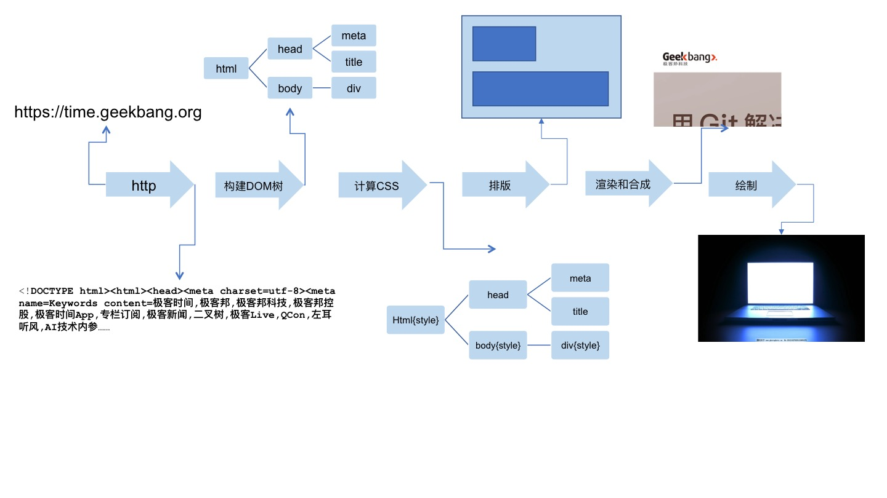

# 浏览器知识

- todo：使用doctoc生成目录

## 浏览器是如何工作的？

- 对浏览器实现者来说，就是讲一个url呈现在屏幕上
  1. 浏览器首先会使用`Http`或`https`协议，向服务端发送请求；
  1. 把请求回来的 HTML 代码经过解析，构建成 DOM 树；
  1. 计算 DOM 树上的 CSS 属性；
  1. 最后根据 CSS 属性对元素逐个进行渲染，得到内存中的位图；
  1. 一个可选的步骤是对位图进行合成，这会极大地增加后续绘制的速度；
  1. 合成之后，再绘制到界面上。
  

- [CSS的渲染过程](#CSS的渲染过程？)

## TCP三次握手、四次挥手过程？

## HTTP标准？

## HTTP2.0新特性？

- 支持服务端推送
- 支持TCP连接复用

## HTTPS的作用？

- 确定请求的目标服务端身份
- 保证传输的数据不会被网络中间节点窃听或者篡改

## CSS的渲染过程？

- 流式渲染，每生成一个`dom`节点，便立即去匹配相应的`css`规则
- `dom`节点的生成顺序是`父->子`。`css`的渲染顺序也是`父节点->子节点`
- 选择器
  - 混合选择器：在激活的时候父元素已经确定好了
  - 后代选择器：所有元素都是父元素，并选中自己的子元素
  - 子元素选择器：只有父元素为当前节点的`dom`元素会被选中
  - 在父元素结束标签时，关闭选择器。