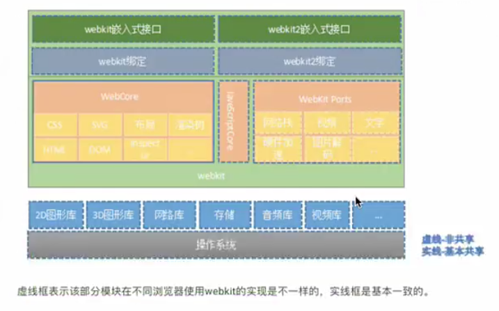
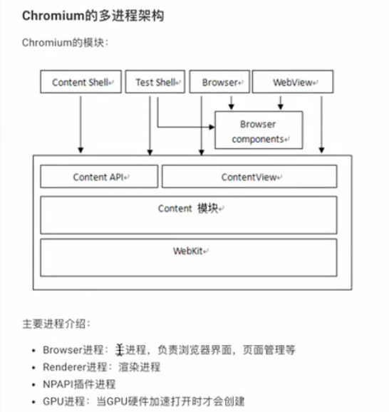
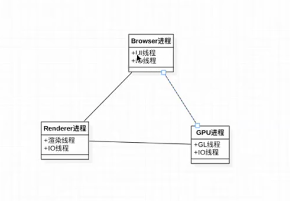

# 浏览器渲染原理

## 思考几个问题

- 我们平常浏览的网页是否是应用？
- 在操作系统中的应用是如何运行的？
- 浏览器究竟是什么？
- webkit和浏览器有什么关系？
- 浏览器是如何呈现网页的？
- 经典问题：从浏览器的地址栏输入一个网址指挥刀网页内容呈现完毕，发生了哪些事情？

## 浏览器

浏览器是用户访问互联网最重要的接口

本质上，浏览器是方便一般互联网用户通过界面解析和发送HTTP协议的软件

### 用户代理的作用

- 判断浏览器类型，采用兼容方案
- 判断是否为移动端
- 标识H5容器，方便调用H5容器特定接口
- 要注意`user-agent`伪装成本很低，不要过于依赖

## 内核

对于操作系统来说，**内核**是操作系统的和核心，是第一层基于硬件的软件扩充，提供最核心最基础的服务。

应用程序通过内核进行**系统调用**来使用计算机的硬件。基于一个稳定版本的内核，开发者可以构建适合不同场景的操作系统和应用软件。例如基于`virtual-dom`这个库，可以开发出`vue`和`react`这些框架。

对于浏览器来说，同样存在**浏览器内核**，与操作系统内核相似，浏览器内核提供API给浏览器开发者使用，同时提供最核心的功能，如**加载和渲染网页，调用操作系统所提供的服务**。

## 浏览器内核知识

### 思考几个问题

- 通过响应的内容，我们可以看到内容中还存在许多外链资源，浏览器是如何处理的？
  - 不同的外联资源，webkit中有不同的资源加载器。当浏览器解析到URL地址时，调用特定的资源加载器。如果不是特殊的资源（js），加载过程不会阻碍渲染过程。
- 著名的优化：“css放在头部，js放在尾部”，为什么？
  - 一般来说css资源不会阻碍渲染过程，但js资源在浏览器中，会阻碍渲染过程的进行。如果放在头部，渲染过程会暂停，造成白屏。但现代浏览器已经优化的很好了，所以当渲染被阻碍是，浏览器会开启新的线程继续渲染。
- 浏览器在渲染之前或之后还要做哪些事情？
  - 渲染之前需要加载资源，渲染之后在DOM或者CSS变化后，重新进行布局计算和重新渲染操作。
- 移动端的浏览器和PC端的浏览器是否相同？
  - 功能基本现年共同，但所运行的操作系统不同，渲染机制有差异。

### 浏览器内核架构

### Chromium架构

思考几个问题：

- 除去webkit内核完成的功能，浏览器的工作有哪些？
  - 资源管理：cookie、storage
  - 多页面管理：也就是多个标签页的管理
  - 插件和扩展：如flash，油猴、Chrome扩展程序
  - 账户和同步
  - 安全机制
  - 多系统支持
- 进程是什么？
  - 对CPU、主存、IO设备的抽象，操作系统对一个正在运行的程序的抽象。
- IPC是什么？
  - 进程间通信：进程间传输信息（交换信息）
- 线程是什么？
  - 组成进程的执行单元。
- 线程同步是什么？
  - 多个线程同时操作同一块资源，会有一定的调度算法。通过信号量。

Chromium的多进程架构

主要进程介绍：

- browser进程：主进程，负责浏览器界面，页面管理等
- render进程：渲染进程
- NPAPI插件进程恒
- GPU进程：当GPU硬件加速打开时才会创建

多进程架构的目的所在：

- 职责分离，故障范围小
- 隔离性
- 性能

#### JavaScript中的进程和线程

单线程

## 浏览器渲染原理

总共分两步：

- 加载：加载渲染所必须的html代码
- 渲染：将html转成图像

### 资源加载机制

#### 资源缓存

- page cache： 页面缓存
- memory cache： 内存缓存
- disk cache： 磁盘缓存

### 预先加载

- dns预取
- 资源预取
- tcp preconnect

## 如何提高加载速度

- 预加载：多个cdn域名、dns预取、异步读取js
- 合并请求（减少链接数）：nginx模块、sprite雪碧图
- 缓存：from cache（memory、disk）、localstorage、本地缓存策略、http头（结合业务）
- tcp网络连接优化：tcp调优、http/2、keep-alive
- 硬件：加大带宽，使用cdn（对象存储）
- 资源大小：gzip、webp、image压缩、减少cookie体积（只存储身份信息）
- 

